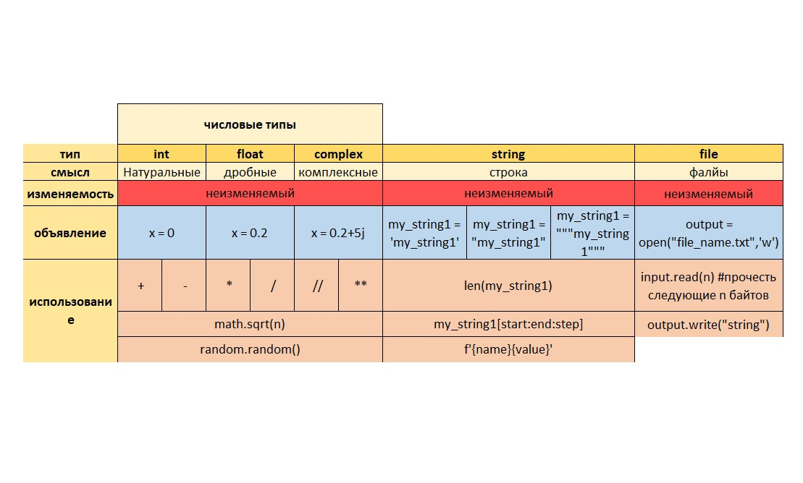
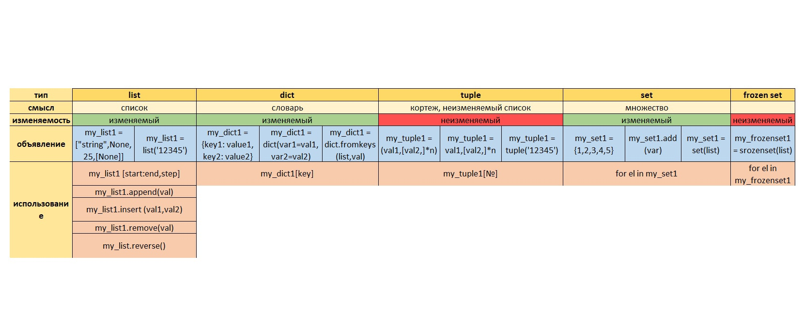

= Python вступление

== Редакторы

. PyCharm Community Edition
. Visual Studio Code
. Vim
. Emacs
. Atom
. Sublime Text
. ~notepad++

== Базовые типы

. числа
. логический тип
. строки и байтовые строки
. None
. ~Контрукции правления потоком

== Числовой тип

Питон поддерживает длинную и ленивую арифметику

Питон поддерживает форму записи числа
n = 1_000_000
а также экспоненциальную
n = 1.5e2 = 1.5*10^2

Питон поддерживает форму записи нескольких чисел в несколько переменных:
a,b = 1,2
Очень удобно для свапа двух переменных:
a,b = b,a

Питон поддерживает комплексный класс чисел:
n = 14+1j
n.real()
n.imag()

== Операции с числами

[cols=2]

|====
|()
|группировка

|*
|умножеие

|**
|степень (или корень: например, x**0.5)

|//
|целочисленное деление

|/
|вещественное деление

|%
|остаток по модулю
|====

== Логические операции

[cols=2]
|====
|\|
|побитовое ИЛИ

|^
|xor (исключающее ИЛИ)

|&
|побитовое И

|<<
|побитовый сдвиг влево

|>>
|побитовый сдвиг вправо

|~
|инверсия битов

|>
|больше (оператор сравнения)

|<
|меньше (оператор сравнения)

|>=
|больше либо равно (оператор сравнения)

|<=
|меньше либо равно (оператор сравнения)

|==
|равно (оператор сравнения)

|!=
|не равно (оператор сравнения)

|bool(<a==0>)
|True

|bool(<a!=0>)
|False

|bool("not empty str")
|True

|bool(None)
|False
|====

Питон поддерживает форму записи
print(1<x<3) //True/False

== Строковый тип

Неизменяемый тип

Сырые строкиpass:[ ]r"file..."

Срезы:pass:[ ]"{num}123({str00)"
str_var[start:stop:step] pass:[ ]
str_var[::-1] - разворот строки задом на перед

"{}123({})".format("s1","s2") pass:[ ]
"{num}123({str0})".format(num = 123, str0 = "...") pass:[ ]

num = 123 pass:[ ]
str0 = "..." pass:[ ]
f"{num}123({str0})"

== Байтовые строки

Строки невозможно передать по сети. Можно только байтовые строки.

S = b"Hello" pass:[ ]
type(S) pass:[ ]
//'bytes' (ASCII) pass:[ ]

S.encode(encoding = "utf-8")
S.decode()

== ПРОЧИТАТЬ
Магические методы

